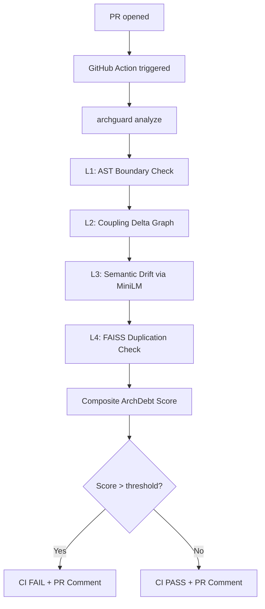

# ArchGuard

[](https://github.com/jainam-b/archguard/actions/workflows/ci.yml)
[](https://pypi.org/project/archguard/)
[](https://pypi.org/project/archguard/)
[](https://codecov.io/gh/jainam-b/archguard)
[](LICENSE)

Architectural drift detector for Python codebases.
Inspects every pull request and flags when code violates defined module boundaries.

## Installation
### Full Install (recommended)
```bash
pip install archguard[all]
```
### Minimal Install (no ML layers)
```bash
pip install archguard
# Note: Layer 3 (Semantic Drift) and Layer 4 (Duplication) require `pip install archguard[ml]`
```

## Quick Start
```bash
cd your-python-project/
archguard init           # Auto-detect architecture
archguard analyze        # Check for violations
```

## Sample Output
```text
┌─────────────────────────────────────────────────────────────────────┐
│ ArchGuard Analysis — health score: 87.5 (Grade: B)                  │
├────────────────┬──────────┬──────────┬───────────────────────────────┤
│ File           │ Type     │ Severity │ Violation                     │
├────────────────┼──────────┼──────────┼───────────────────────────────┤
│ api/service.py │ layer    │ CRITICAL │ api imports from db directly  │
│ utils/parse.py │ coupling │ HIGH     │ instability: 0.92 (max: 0.80) │
└────────────────┴──────────┴──────────┴───────────────────────────────┘
```

## Architecture

ArchGuard runs 4 analysis layers on changed Python files:

1. **Layer Enforcement**: Validates that explicit import boundaries defined in your contract aren't violated.
2. **Coupling Delta**: Checks module "fan-out" and ensures no individual module becomes unexpectedly unstable or overly coupled to others.
3. **Semantic Cohesion**: Employs an LLM embedding engine to look for files that have semantically drifted out of their community.
4. **Duplication Detection**: Employs FAISS to locate excessive cross-module code duplication signaling a missed abstraction.

These passes result in an aggregate **ArchDebt score** and can optionally utilize cloud LLMs to provide explanatory fixes for severe violations.

## How It Works


## Tracking Architecture Health Over Time

You can visualize your project's historical architectural health using the `trends` command, which parses the local audit log:

```bash
archguard trends
```

```text
┌─────────────────────┬───────┬───────┬────────────┐
│ Timestamp           │ Score │ Grade │ Violations │
├─────────────────────┼───────┼───────┼────────────┤
│ 2024-01-15 10:30    │  87.5 │ B     │          3 │
│ 2024-01-14 09:15    │  82.0 │ B-    │          5 │
│ 2024-01-13 14:00    │  79.5 │ C+    │          7 │
└─────────────────────┴───────┴───────┴────────────┘
Trend: ↑ +8.0 points over 3 runs (improving)
Score history: ▃▄▄▅▆▇█
```

*Tip: Use `archguard trends --json` to export this data to a headless dashboard!*

## Interactive HTML Reports

You can generate a self-contained, interactive HTML dashboard to visualize your project's architectural integrity:

```bash
archguard report --output dashboard.html --open
```

The report operates entirely offline and includes:
- **Summary Cards**: At-a-glance grades and scores.
- **Dependency Graph**: An interactive network mapping module relationships (powered by vis.js).
- **Health Trends**: A historical line chart mapping point degradation/improvements (powered by Chart.js).
- **Violations**: A sortable grid of specific module breaches.

## Configuration Profiles

ArchGuard includes preset configuration profiles (`strict`, `lenient`, `ci`) out-of-the-box to make it easier to adopt architectural enforcement in different environments:

```bash
# Apply a strict profile over your current codebase
archguard analyze --profile strict
```

You can view all available presets via:
```bash
archguard profiles list
```

You can also specify a profile globally by answering the interactive prompt during `archguard init` or manually placing it at the root of your `.archguard.yml` file:
```yaml
schema_version: "3.0"
profile: "ci"
modules:
...
```

## CI/CD Integration

We recommend executing ArchGuard via GitHub Actions on every pull request.

```yaml
- name: Pull ArchGuard cache from S3
  run: archguard sync pull --bucket my-archguard-cache
  env:
    AWS_ACCESS_KEY_ID: ${{ secrets.AWS_ACCESS_KEY_ID }}
    AWS_SECRET_ACCESS_KEY: ${{ secrets.AWS_SECRET_ACCESS_KEY }}
- name: Run ArchGuard
  uses: your-org/archguard@v1
  with:
    pr-number: ${{ github.event.pull_request.number }}
    skip-explanation: 'false'   # Set 'true' to skip LLM calls (faster, free)
  env:
    GITHUB_TOKEN: ${{ secrets.GITHUB_TOKEN }}
    ANTHROPIC_API_KEY: ${{ secrets.ANTHROPIC_API_KEY }}  # Optional: omit to use local Ollama
- name: Push updated cache to S3
  run: archguard sync push --bucket my-archguard-cache
  env:
    AWS_ACCESS_KEY_ID: ${{ secrets.AWS_ACCESS_KEY_ID }}
    AWS_SECRET_ACCESS_KEY: ${{ secrets.AWS_SECRET_ACCESS_KEY }}
```

**JSON Output for headless tools:**

```bash
archguard analyze --json | jq '.summary'
```

## Testing
### Unit Tests
poetry run pytest tests/unit/ -v
### Integration Tests  
poetry run pytest tests/integration/ -v
### Docker Smoke Test
make smoke-test

## FAQ

**How do I use a local LLM instead of Gemini?**
Set `export ARCHGUARD_LLM_PROVIDER=ollama` and ensure you have an ollama instance running locally. The CLI will pick up local models automatically.

**How do I suppress a false positive?**
Run `archguard suppress add <violation-message>` to explicitly whitelist specific violations.

**What does the health score mean?**
The health score (0-100) measures your project's architectural integrity against the baseline contract. A grade below your configured fail threshold will exit non-zero and fail CI.

## Contributing

See [CONTRIBUTING.md](CONTRIBUTING.md) for details on our code of conduct and the process for submitting pull requests to us.

## Security

See [SECURITY.md](SECURITY.md) for information on our security policy and how to report vulnerabilities.

## Troubleshooting
### `ModuleNotFoundError: No module named 'numpy'`
Install ML dependencies: `pip install archguard[ml]`
### GitHub Action always shows score `0` / band `Unknown`
Ensure you're using version 2+ of the action. Older versions had an output extraction bug (fixed in v0.2.0).
### `Permission denied` writing `.archguard-cache/`
In GitHub Actions with Docker, ensure the workspace is writable. The action's `entrypoint.sh` handles this automatically as of v0.2.0.
### Analysis skips all files / shows 0 changed files
If your repo has a single commit, use `--base-ref` to specify the comparison ref, or run `archguard analyze --all-files` to analyze everything.

## License

MIT
