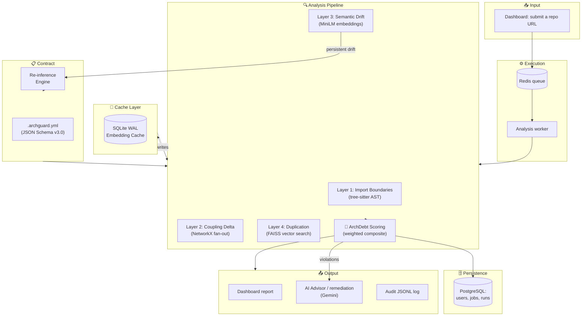

# ArchGuard
> **Architectural drift detection for Python repositories, as a web application**
> Point it at a public GitHub repository and get a measured report on import
> boundary violations, coupling degradation, semantic drift and duplication.

[](https://github.com/jainamsethia/ArchGuard/actions/workflows/ci.yml) [](LICENSE) [](https://hub.docker.com/)

**[🚀 Run it locally](#run-it-locally) · [📖 Architecture](#architecture) · [⚙ Configuration](#configuration) · [🔑 Environment variables](#environment-variables)**

ArchGuard is a deployed service, not a command-line tool. A visitor signs in
with GitHub, submits a repository URL, watches the analysis progress over an
SSE stream, and lands on a dashboard of the result. Analyses run in a separate
worker process behind a Redis queue; users, jobs, runs and suppressions live in
PostgreSQL.

## Run it locally

```bash
cp .env.example .env
# Set at minimum DATABASE_URL, REDIS_URL and SESSION_SECRET. GEMINI_API_KEY
# is optional and enables the AI Advisor and remediation plans.
docker compose up
# Open http://localhost:8000
```

To run the app directly against containerised datastores instead:

```bash
docker compose up -d postgres redis
```

```bash
poetry install --with dev
```

```bash
poetry run alembic upgrade head
```

```bash
poetry run uvicorn archguard.dashboard.app:app --reload --port 8000
```

Layers 3 and 4 need the ML extra, which is large (~800 MB installed, torch
included) and belongs to the worker rather than the web process:

```bash
poetry install --with dev --extras worker
```

```bash
poetry run arq archguard.worker.main.WorkerSettings
```

Neither Alembic nor the worker reads `.env` — only the web app calls
`load_dotenv()` — so export the variables into your shell before running them.

## Architecture




Every analysis runs the same four layers:

| Layer | Signal | Technology |
|-------|--------|------------|
| Boundary | Forbidden cross-module imports | tree-sitter AST |
| Coupling | Fan-out exceeds budget | NetworkX graph |
| Semantic | Embedding centroid drift | MiniLM + cosine similarity |
| Duplication | Cross-module function clones | FAISS vector search |

Layers 3 and 4 are skipped, and say so in the report, when the ML extra is not
installed or `ARCHGUARD_SKIP_ML=1` is set. A layer with nothing to check must
not read as a layer that found nothing.

## Technical highlights

- **4-layer analysis**: AST parsing + graph coupling + ML embeddings + FAISS vector search.
- **Louvain community detection** on the commit co-change graph, so module boundaries are measured from how the code actually changes rather than guessed from directory names. When history is unavailable the report says the boundaries were guessed.
- **Incremental embeddings**: a SQLite WAL cache keyed by function content hash, so an unchanged function is never re-embedded. Measured on this repository: a repeat analysis in a warm worker costs ~4s against ~29s cold, with Layer 3 falling from 26.5s to 2.0s. See [ADR-009](docs/adr/009-incremental-reanalysis.md).
- **Resilient LLM calls**: Gemini Flash primary with automatic fallback to Flash-Lite on a rate limit, server error, timeout, or a retired model id.
- **Re-inference engine**: proposes contract updates when semantic drift persists across runs.

## Dashboard workflow

1. Sign in with GitHub. Analyses are private to your account.
2. Submit a public repository URL on the landing page.
3. An SSE stream reports progress per phase while the worker runs the analysis.
4. On completion you land on `dashboard.html?job_id=…` with the new run selected.

Opening the dashboard with no recorded runs shows an empty state pointing back
to the submit page rather than a blank screen.

## Features

### Architecture fitness functions
Rules declared in `.archguard.yml` are evaluated on every run, and their
pass/fail state appears on the dashboard.

### AI Advisor
An LLM-backed panel answering architecture questions in the context of the
current run's metrics, drift and violations. Streams over SSE. Requires
`GEMINI_API_KEY`; without it the panel says so rather than failing silently.

### AI remediation plans
Synthesises ranked, step-by-step refactoring suggestions from the run's
violations. Every finding stays in the violations table — only eligibility for
an AI-written fix is capped, and the counts say so.

### Module blast radius
For each module, how many other modules transitively depend on it — the reach
of a change — computed from the analysed repository's dependency graph.

### Evolution tracking
Health, debt, violation and fitness trends across recorded runs, plus an
on-demand pass over real git history.

### Dependency health
`pip-audit` over the analysed repository's declared dependencies, folded into
the overall score.

## Configuration

Analysis is driven by `.archguard.yml` in the analysed repository. If the file
is absent, ArchGuard generates one headlessly and reports whether the module
boundaries were measured from co-change history or inferred from directory
names.

Three threshold profiles ship in `archguard.profiles.defaults` and are applied
when a contract names one:

```yaml
version: "3.0"
profile: "ci"
modules:
  - name: api
    path: api/
```

- **strict** — mature codebases wanting production-grade enforcement.
- **lenient** — greenfield or legacy code where enforcement should be minimal.
- **ci** — balanced defaults for most pipelines.

## Environment variables

`.env.example` is the copy-pasteable template and the authoritative reference;
it marks any variable that is documented but not yet wired. The essentials:

| Variable | Default | Purpose |
|---|---|---|
| `DATABASE_URL` | _(required)_ | PostgreSQL, `postgresql+asyncpg://…`. There is no file-based fallback. |
| `REDIS_URL` | _(required)_ | Sessions, rate limits, job progress and the analysis queue. |
| `SESSION_SECRET` | _(required)_ | HMAC key for session cookies. Generate with `python -c "import secrets; print(secrets.token_hex(32))"`. |
| `ENVIRONMENT` | `development` | Set to `production` to enable the startup configuration gate and secure cookies. |
| `ALLOWED_ORIGINS` | localhost set | Comma-separated CORS origins. `*` is refused in production. |
| `GEMINI_API_KEY` | _(none)_ | Powers the AI Advisor and remediation plans. Omit to disable both. |
| `GEMINI_MODEL` | `gemini-3.6-flash` | Model for one-shot calls. |
| `ARCHGUARD_PRIMARY_MODEL` | `gemini-3.6-flash` | Primary model for explanations and contract inference. |
| `ARCHGUARD_FALLBACK_MODEL` | `gemini-3.5-flash-lite` | Used when the primary is rate-limited, unreachable, or has been retired. |
| `GITHUB_OAUTH_CLIENT_ID` / `_SECRET` | _(none)_ | Required in production; without them nobody can sign in. |
| `GITHUB_TOKEN` | _(none)_ | Raises the GitHub API limit above 60 req/hr. |
| `ARCHGUARD_TRUSTED_PROXY_IPS` | _(none)_ | Proxy CIDR. Without it every request is attributed to the proxy and all users share one rate-limit bucket. |
| `ARCHGUARD_SKIP_ML` | _(unset)_ | Skip Layers 3 and 4 even when the extras are installed. |
| `ARCHGUARD_MOCK_LLM` | _(unset)_ | Return fixed responses instead of calling Gemini. Used by CI and the browser tests. |
| `ARCHGUARD_AUDIT_SECRET` | _(auto)_ | HMAC key for the audit log. See [Audit log security](#audit-log-security). |
| `ARCHGUARD_CLONE_TIMEOUT` | `120` | Seconds to wait for a git clone. |
| `ARCHGUARD_ANALYSIS_TIMEOUT` | `600` | Seconds to wait for the pipeline. |

## Deploy

### Railway
Create a project from this repo; `railway.toml` supplies build and healthcheck
config. Set `DATABASE_URL`, `REDIS_URL`, `SESSION_SECRET`,
`GITHUB_OAUTH_CLIENT_ID`, `GITHUB_OAUTH_CLIENT_SECRET`, `ALLOWED_ORIGINS` and
`ARCHGUARD_TRUSTED_PROXY_IPS`. `ENVIRONMENT=production` is already set in
`railway.toml`.

### Render
[](https://render.com/deploy?repo=https://github.com/jainamsethia/ArchGuard)

The same variables apply. `ARCHGUARD_TRUSTED_PROXY_IPS` is already configured
in `render.yaml`.

With `ENVIRONMENT=production` the app refuses to start on a misconfiguration
that would otherwise produce no error — a wildcard CORS origin, a missing or
reused session secret, no OAuth app, an unwritable data directory — and reports
every problem at once rather than one restart at a time.

### Health endpoints

| Endpoint | Answers |
|---|---|
| `/health` | Liveness. Answers even with no database. |
| `/ready` | Readiness. 503 when a backing service is unreachable. |
| `/metrics` | Prometheus text, including `archguard_database_up`. |

## Testing

```bash
poetry run pytest tests/unit tests/integration -q
```

```bash
npm test
```

```bash
npx playwright test tests/a11y/ tests/visual/
```

The browser suites need a server. Playwright starts one itself, except on
Windows where a known runner hang means you should start `uvicorn` on port 8765
yourself and set `PLAYWRIGHT_REUSE_SERVER=1` — see the notes in
`playwright.config.ts`.

Database-backed tests skip loudly rather than silently when `TEST_DATABASE_URL`
is unset. Point it at a **separate** database: the integration tests migrate it
up and tear it back down to base.

## FAQ

**Is there a CLI?**
No. ArchGuard shipped one and it was removed — the product is the web
application. Anything you may have read about `archguard analyze`, `archguard
init`, a GitHub Action, S3 cache sync or PR comments describes a version that no
longer exists.

**How do I use a local LLM instead of Gemini?**
You can't. Gemini is the only backend. An unwired Ollama provider used to ship
in `archguard.llm.local`; it was never reachable and has been removed rather
than left as a feature the docs implied existed.

**How do I run without any LLM calls?**
Leave `GEMINI_API_KEY` unset — the Advisor and remediation panels then say they
are unavailable. `ARCHGUARD_MOCK_LLM=1` returns fixed responses instead.

**How do I suppress a false positive?**
From the Violations tab on the dashboard. Suppressions are stored per
repository and excluded from the score and the active-violation count.

**What does the health score mean?**
0–100, higher is better, measured against the contract. It is the inverse of
the ArchDebt composite: `Health = (1 − ArchDebt) × 100`.

## Known limitations

- **Python version skew in standard-library classification.** The engine uses the standard-library module list of the interpreter it runs under. Analysing a repository targeting a different version (running on 3.11 but analysing code using a 3.12 module) can misclassify a small number of version-boundary modules as third-party.
- **SSE progress-stream tokens are process-local.** `EventSource` cannot set request headers, so the progress stream is authenticated by a token in the URL, held in memory. Behind a load balancer a token minted by one replica does not validate on another, and an in-flight stream loses its token across a restart. Single-instance deployments are unaffected.

## Audit log security

ArchGuard keeps an append-only JSONL audit log. To make tampering detectable:

- A random 32-byte HMAC key is generated on first run and persisted to `.archguard-cache/audit.key` — mounted from the `archguard-cache` volume under Docker Compose, a Render Disk, or a Railway Volume. Railway volume attachment is a dashboard step, not part of the checked-in `railway.toml`.
- Override it by setting `ARCHGUARD_AUDIT_SECRET`.
- Set `ARCHGUARD_AUDIT_STRICT=1` in production to refuse auto-generation and require a provided key.

## Contributing

See [CONTRIBUTING.md](CONTRIBUTING.md).

## Security

See [SECURITY.md](SECURITY.md).

## License

MIT
