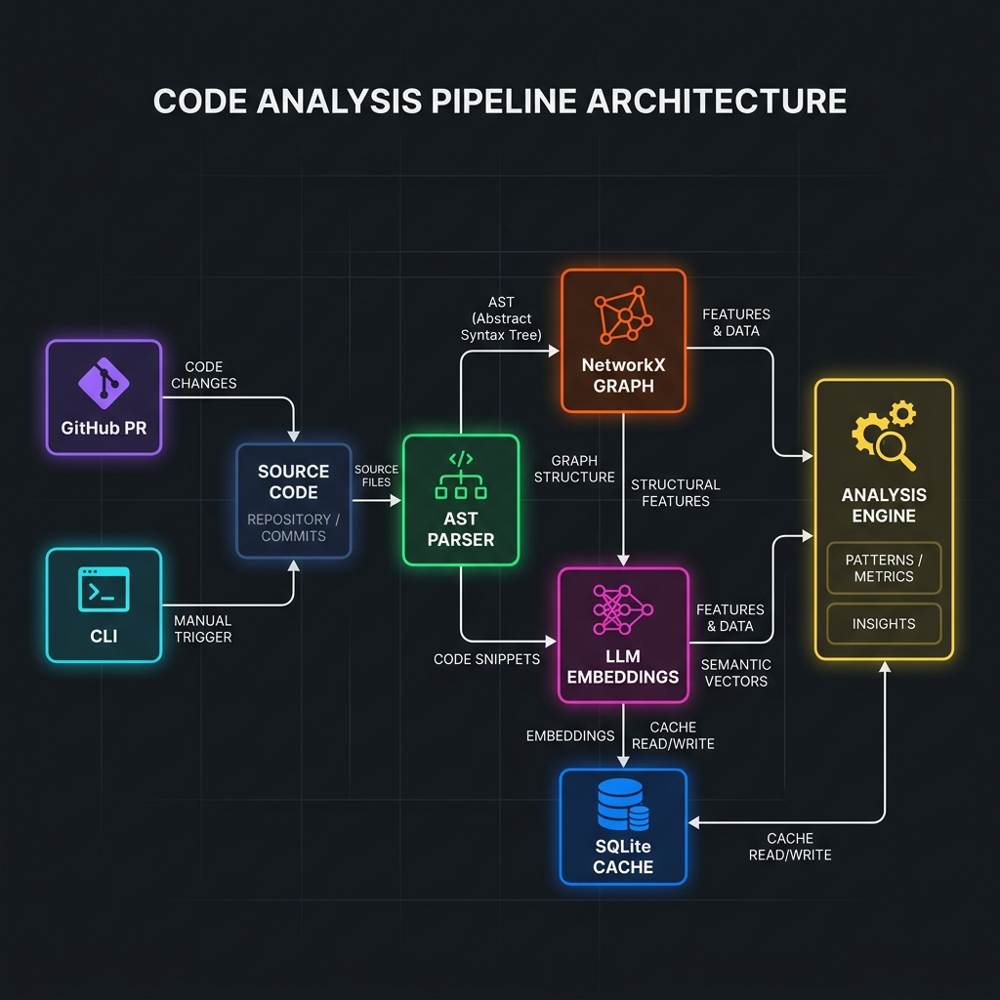
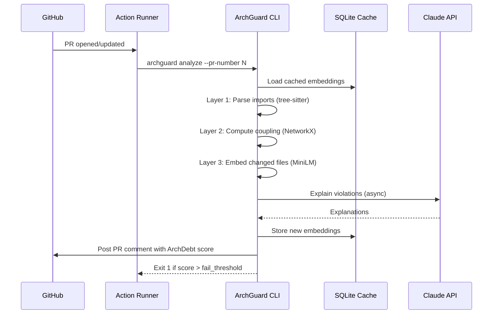

# ArchGuard
> **Architectural drift detection for Python CI pipelines**
> Catches import boundary violations, coupling degradation, and semantic drift before they reach main.

[](https://github.com/jainam-b/archguard/actions/workflows/ci.yml) [](https://codecov.io/gh/jainam-b/archguard) [](https://pypi.org/project/archguard/) [](https://pypi.org/project/archguard/) [](LICENSE) [](https://hub.docker.com/)

**[📺 Live Demo](#screenshots) · [📖 Docs](#architecture) · [🚀 Quick Start](#quick-start)**

## Deploy

### One-click deploy to Railway
[](https://railway.app/template/archguard)

**Required environment variables to set in Railway dashboard:**
- `ANTHROPIC_API_KEY` — for L4 LLM explanations (optional but recommended)
- `GITHUB_TOKEN` — for GitHub API access (optional; 60 req/hr without)
- `ARCHGUARD_DASHBOARD_TOKEN` — secures the dashboard API with Bearer auth
- `ALLOWED_ORIGINS` — comma-separated frontend domains (e.g. `https://your-app.vercel.app`)
- `ARCHGUARD_TRUSTED_PROXY_IPS` — must be set to the hosting platform's actual proxy range for per-user rate limiting to function correctly (e.g., set this out-of-band via the Railway dashboard or CLI since railway.toml cannot declare env vars).

### Deploy to Render
[](https://render.com/deploy?repo=https://github.com/your-org/archguard)

Set the same environment variables in the Render dashboard under **Environment**. Note that `ARCHGUARD_TRUSTED_PROXY_IPS` is already configured directly in `render.yaml` with the appropriate CIDR range.

### Run locally with Docker Compose
```bash
cp .env.example .env
# Edit .env to add your API keys
docker compose up
# Open http://localhost:8000
```
## Architecture



```mermaid
flowchart TB
subgraph Input["📥 Input"]
GH[GitHub PR]
CLI[Local CLI]
end
subgraph Pipeline["🔍 Analysis Pipeline"]
direction TB
L1["Layer 1: Import Boundaries\n(tree-sitter AST)"]
L2["Layer 2: Coupling Delta\n(NetworkX fan-out)"]
L3["Layer 3: Semantic Drift\n(MiniLM embeddings)"]
L4["Layer 4: Duplication\n(FAISS vector search)"]
EXPLAIN["LLM Explanation\n(Claude)"]
SCORE["🧮 ArchDebt Scoring\n(weighted composite)"]
end
subgraph Cache["💾 Cache Layer"]
SQLITE[(SQLite WAL\nEmbedding Cache)]
INCR[SHA-256\nIncremental Hash]
end
subgraph Output["📤 Output"]
COMMENT[PR Comment]
HTML[HTML Report]
AUDIT[Audit JSONL Log]
EXIT[CI Exit Code]
end
subgraph Contract["📋 Contract"]
YAML[.archguard.yml\n(JSON Schema v3.0)]
REINFER[Re-inference\nEngine]
end
Input --> Pipeline
Pipeline --> SCORE
SCORE --> Output
Cache -.->|Cache reads| Pipeline
Pipeline -.->|Cache writes| Cache
Contract --> Pipeline
L3 -->|persistent drift| REINFER
REINFER --> Contract
SCORE -->|violations| EXPLAIN
EXPLAIN --> Output
```

ArchGuard runs a 4-layer analysis pipeline on every PR:

| Layer | Signal | Technology |
|-------|--------|------------|
| Boundary | Forbidden cross-module imports | tree-sitter AST |
| Coupling | Fan-out exceeds budget | NetworkX graph |
| Semantic | Embedding centroid drift | MiniLM + cosine similarity |
| Duplication | Cross-module function clones | FAISS vector search |

Results posted as a PR comment with an ArchDebt score and LLM-generated explanation.

## Live Demo
- [Demo Repository](https://github.com/jainam-b/archguard-demo) — See ArchGuard running on a realistic Python codebase
- [Sample PR with violations](https://github.com/jainam-b/archguard-demo/pulls) — Example of a failing ArchGuard check
- [Sample PR that passes](https://github.com/jainam-b/archguard-demo/pulls) — Example of a clean PR
- [Live Dashboard](https://archguard-demo.up.railway.app) — Sample ArchDebt report with trend chart

## Screenshots

<!-- Demo GIF: run `vhs docs/demo.tape` to generate docs/demo.gif -->
> 📹 **Demo:** Clone the repo and run `vhs docs/demo.tape` to generate the demo GIF.

<!-- Screenshot coming — run `archguard analyze --repo .` to see live output -->
*Rich terminal output of archguard analyze with score table and violations.*

<!-- Screenshot coming — run `archguard analyze --repo .` to see live output -->
*Automated PR comment detailing ArchDebt score and architectural regressions.*

<!-- Screenshot coming — run `archguard analyze --repo .` to see live output -->
*Interactive HTML dashboard charting structural health trends.*

## Technical Highlights
- **4-layer analysis**: AST parsing + graph coupling + ML embeddings + FAISS vector search
- **Louvain community detection** on commit co-change graph for automatic contract generation
- **Incremental analysis**: SHA-256 file hashing + SQLite WAL cache — only recomputes changed files
- **Resilient LLM explanations**: Claude Sonnet (primary) with automatic fallback to Claude Haiku on rate-limit or timeout, dispatched with concurrent async calls. A local-model (Ollama) backend exists in `archguard.llm.local` but is not yet wired into the CLI's explanation path — tracked for a future release.
- **Re-inference engine**: proposes contract updates when semantic drift persists across PRs

## Phase 3: Architecture Intelligence

ArchGuard integrates multiple intelligent components to actively evaluate and guide architectural evolution:

### Architecture Fitness Functions
Define architectural rules in `.archguard.yml` and enforce them automatically during CI. ArchGuard evaluates functions strictly and exits with non-zero status on critical rule failures. Supported natively via the CLI.

### AI Advisor
An interactive, LLM-driven AI Advisor (accessible via `archguard.llm.advisor` and the local dashboard API) providing dynamic insights based on architectural metrics, drift analysis, and known constraints. Supports streaming responses via the Anthropic SDK.

### Architecture Evolution Tracking
Parse historical analysis logs over time. Provides detailed tracking of health scores and trend analysis (e.g. tracking point degradation/improvements across commit boundaries) natively via the `history` CLI command.

### AI Remediation Plans
A dedicated remediation engine (`archguard.llm.remediation`) capable of analyzing layer-specific violation thresholds and automatically synthesizing step-by-step refactoring recommendations. 

### PR Risk Analysis
The `PRRiskAnalyzer` automatically computes contextual risk scores for inbound code changes by traversing dependencies directly affected by modified files and highlighting downstream risks.

### Dependency Health Score
Native integration with `pip-audit` to evaluate real-time third-party vulnerability awareness, merging software supply chain health into overall project architectural scoring.

## CLI Commands

The core commands include:
```bash
archguard init                  # Auto-detect architecture and create .archguard.yml
archguard analyze               # Run full 4-layer drift analysis
archguard fitness check         # Evaluate configured fitness functions
archguard fitness check --json  # Return fitness results as JSON
archguard history --format json # Output history trend as JSON
archguard report --slim         # Output minimalist CDN-ready HTML report
```

## Installation
### Full Install (recommended)
```bash
pip install -e ".[all]"
```
### Minimal Install (no ML layers)
```bash
pip install -e .
# Note: Layer 3 (Semantic Drift) and Layer 4 (Duplication) require `pip install -e ".[ml]"`
```

## Quick Start
```bash
cd your-python-project/
archguard init           # Auto-detect architecture
archguard analyze        # Check for violations
```

## Sample Output
```text
┌─────────────────────────────────────────────────────────────────────┐
│ ArchGuard Analysis — health score: 87.5 (Grade: B)                  │
├────────────────┬──────────┬──────────┬───────────────────────────────┤
│ File           │ Type     │ Severity │ Violation                     │
├────────────────┼──────────┼──────────┼───────────────────────────────┤
│ api/service.py │ layer    │ CRITICAL │ api imports from db directly  │
│ utils/parse.py │ coupling │ HIGH     │ instability: 0.92 (max: 0.80) │
└────────────────┴──────────┴──────────┴───────────────────────────────┘
```

## Tracking Architecture Health Over Time

You can visualize your project's historical architectural health using the `history` command, which parses the local audit log:

```bash
archguard history --format trend
```

```text
┌─────────────────────┬───────┬───────┬────────────┐
│ Timestamp           │ Score │ Grade │ Violations │
├─────────────────────┼───────┼───────┼────────────┤
│ 2024-01-15 10:30    │  87.5 │ B     │          3 │
│ 2024-01-14 09:15    │  82.0 │ B-    │          5 │
│ 2024-01-13 14:00    │  79.5 │ C+    │          7 │
└─────────────────────┴───────┴───────┴────────────┘
Trend: ↑ +8.0 points over 3 runs (improving)
Score history: ▃▄▄▅▆▇█
```

*Tip: Use `archguard history --format json` to export this data to a headless dashboard!*

## Dashboard Workflow

ArchGuard provides a local web dashboard to analyze repositories dynamically. The user flow is as follows:
1. Navigate to `index.html` and submit a GitHub URL for analysis.
2. An SSE (Server-Sent Events) stream provides real-time progress updates.
3. Upon completion, you are redirected to `dashboard.html?job_id=...` where the new run is highlighted.

**First-time Users:** If you navigate directly to `dashboard.html` without any prior runs, you will be greeted with an empty state and a Call-To-Action (CTA) guiding you back to `index.html` to start your first analysis.

## Interactive HTML Reports

You can generate a self-contained, interactive HTML dashboard to visualize your project's architectural integrity:

```bash
archguard report --output dashboard.html --open
```

The report operates entirely offline and includes:
- **Summary Cards**: At-a-glance grades and scores.
- **Dependency Graph**: An interactive network mapping module relationships (powered by vis.js).
- **Health Trends**: A historical line chart mapping point degradation/improvements (powered by Chart.js).
- **Violations**: A sortable grid of specific module breaches.

## Configuration Profiles

ArchGuard includes preset configuration profiles (`strict`, `lenient`, `ci`) out-of-the-box to make it easier to adopt architectural enforcement in different environments:

```bash
# Apply a strict profile over your current codebase
archguard analyze --profile strict
```

You can view all available presets via:
```bash
archguard profiles list
```

### Which profile do I want?
- **strict**: Use this for mature codebases where you want production-grade enforcement as a hard CI gate. It demands high cohesion and low coupling.
- **lenient**: Use this for local development, exploratory testing, greenfield projects, or legacy codebases where you want minimal enforcement.
- **ci**: Use this for balanced enforcement in most standard CI pipelines, providing reasonable defaults without being overly restrictive.

You can also specify a profile globally by answering the interactive prompt during `archguard init` or manually placing it at the root of your `.archguard.yml` file:
```yaml
version: "3.0"
profile: "ci"
modules:
...
```

## CI/CD Integration

We recommend executing ArchGuard via GitHub Actions on every pull request.



```yaml
- name: Pull ArchGuard cache from S3
  run: archguard sync pull --bucket my-archguard-cache
  env:
    AWS_ACCESS_KEY_ID: ${{ secrets.AWS_ACCESS_KEY_ID }}
    AWS_SECRET_ACCESS_KEY: ${{ secrets.AWS_SECRET_ACCESS_KEY }}
- name: Run ArchGuard
  uses: your-org/archguard@v1
  with:
    pr-number: ${{ github.event.pull_request.number }}
    skip-explanation: 'false'   # Set 'true' to skip LLM calls (faster, free)
  env:
    GITHUB_TOKEN: ${{ secrets.GITHUB_TOKEN }}
    ANTHROPIC_API_KEY: ${{ secrets.ANTHROPIC_API_KEY }}  # Optional: omit to use local Ollama
- name: Push updated cache to S3
  run: archguard sync push --bucket my-archguard-cache
  env:
    AWS_ACCESS_KEY_ID: ${{ secrets.AWS_ACCESS_KEY_ID }}
    AWS_SECRET_ACCESS_KEY: ${{ secrets.AWS_SECRET_ACCESS_KEY }}
```

**Exit codes:**
- `0` - Success, no violations above threshold
- `1` - Violations detected
- `2` - Configuration error (missing or invalid `.archguard.yml`)
- `3` - Analysis error
- `4` - Authentication error

**JSON Output for headless tools:**

```bash
archguard analyze --json | jq '.summary'
```

## Environment Variables

See `.env.example` for a copy-pasteable template. Full reference:

| Variable | Default | Purpose |
|---|---|---|
| `ANTHROPIC_API_KEY` | _(none)_ | Claude API key for LLM violation explanations. Omit to skip explanations. |
| `ARCHGUARD_PRIMARY_MODEL` | `claude-sonnet-4-20250514` | Primary Claude model for explanations. |
| `ARCHGUARD_FALLBACK_MODEL` | `claude-haiku-4-5-20251001` | Fallback Claude model used on rate-limit/timeout. |
| `OPENAI_API_KEY` | _(none)_ | **Required** for the dashboard's AI Advisor panel — a separate provider from the Anthropic key above. |
| `OPENAI_MODEL` | `gpt-4-turbo` | Model used for Advisor sessions. |
| `OPENAI_BASE_URL` | `https://api.openai.com/v1` | Override for OpenAI compatible endpoints. |
| `OLLAMA_MODEL` | `llama3` | Local-model name (implemented but not yet reachable from the CLI — see FAQ). |
| `ARCHGUARD_DASHBOARD_TOKEN` | _(none)_ | Bearer token for dashboard API auth. Required for non-localhost access. When `ARCHGUARD_DASHBOARD_TOKEN` is set, visiting the dashboard URL in a browser displays a one-time token-entry form. After entering the token, a 24-hour session cookie is issued and the dashboard is fully functional. The session TTL is configurable via `ARCHGUARD_SESSION_COOKIE_TTL` (seconds; default 86400). API and CLI clients continue to use `Authorization: Bearer <token>` as before. |
| `ARCHGUARD_DASHBOARD_ALLOW_REMOTE` | `false` | Explicit opt-in for unauthenticated remote dashboard access. Not recommended. |
| `ARCHGUARD_TRUSTED_PROXY_IPS` | _(none)_ | IP ranges of trusted proxies. Required if running the dashboard behind a load balancer to ensure auth restrictions work. |
| `ARCHGUARD_AUDIT_SECRET` | _(auto-generated)_ | HMAC key for the tamper-evident audit log. See "Audit Log Security" below. |
| `ARCHGUARD_AUDIT_STRICT` | `false` | Require a secure secret to be present; refuse to auto-generate one. |
| `GITHUB_TOKEN` | _(none)_ | Required for `archguard github-sync` and PR comment posting. |
| `AWS_ACCESS_KEY_ID` / `AWS_SECRET_ACCESS_KEY` | _(none)_ | Required for `archguard sync push/pull` (S3 cache backend). |
| `ARCHGUARD_SKIP_ML` | `false` | Skip Layer 3/4 even if ML extras are installed. |
| `ARCHGUARD_SKIP_LLM` | `false` | Skip LLM explanations even if `ANTHROPIC_API_KEY` is set. |
| `ARCHGUARD_MOCK_LLM` | `false` | Use a fixed mock response instead of calling the LLM — used in CI/tests. |
| `ARCHGUARD_TEST_MODE` | `false` | Set by the test suite and CI; **currently read nowhere in `archguard/` source** — has no effect today. |

## Testing
### Unit Tests
poetry run pytest tests/unit/ -v
### Integration Tests
poetry run pytest tests/integration/ -v
### Docker Smoke Test
make smoke-test

## FAQ

**How do I use a local LLM instead of Claude?**
Local-model support (via Ollama) is implemented in `archguard.llm.local.LocalLLMExplainer` but is not currently wired into the `archguard analyze` command path — only the Anthropic Claude backend is reachable today. Setting `ARCHGUARD_LLM_PROVIDER` has no effect. If you want to skip LLM explanations entirely without Ollama, run `archguard analyze --no-llm`.

**How do I suppress a false positive?**
Run `archguard suppress add <violation-message>` to explicitly whitelist specific violations.
Alternatively, you can suppress violations via a PR comment using the syntax:
`/archguard suppress <module> <layer> <message>`
Example: `/archguard suppress api 1 "Imports from db directly"`

**What does the health score mean?**
The health score (0-100) measures your project's architectural integrity against the baseline contract. A grade below your configured fail threshold will exit non-zero and fail CI.

## Contributing

See [CONTRIBUTING.md](CONTRIBUTING.md) for details on our code of conduct and the process for submitting pull requests to us.

## Audit Log Security

ArchGuard maintains an append-only JSONL audit log to track structural history. To prevent tampering:
- By default, ArchGuard generates a random 32-byte HMAC key on first run, persisting it to `/app/.archguard-cache/audit.key` inside the container (mounted from the archguard-cache volume on Docker Compose, a Render Disk, or a Railway Volume, depending on platform. Note: Railway's volume attachment is a dashboard/IaC step, not part of the checked-in railway.toml) with strict permissions.
- You can override this by setting `ARCHGUARD_AUDIT_SECRET` in your environment.
- In CI/CD or production environments, you should set `ARCHGUARD_AUDIT_STRICT=1` to enforce that a secure secret is provided (or a key file is already present).

## Security

See [SECURITY.md](SECURITY.md) for information on our security policy and how to report vulnerabilities.

## License

MIT
