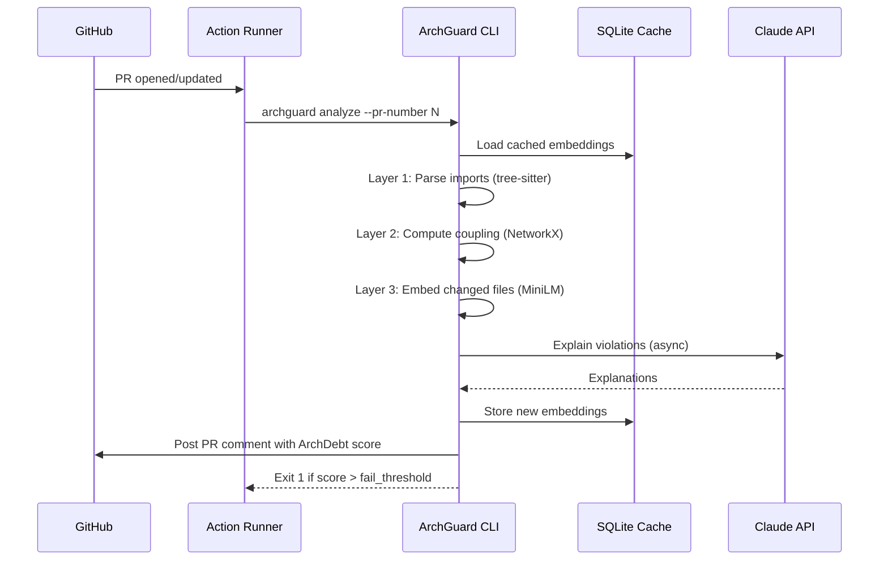

# ArchGuard
> **Architectural drift detection for Python CI pipelines**  
> Catches import boundary violations, coupling degradation, and semantic drift before they reach main.

[](https://github.com/jainam-b/archguard/actions/workflows/ci.yml) [](https://codecov.io/gh/jainam-b/archguard) [](https://pypi.org/project/archguard/) [](https://pypi.org/project/archguard/) [](LICENSE) [](https://hub.docker.com/)

**[📺 Live Demo](#screenshots) · [📖 Docs](#architecture) · [🚀 Quick Start](#quick-start)**

## Architecture


```mermaid
flowchart TB
subgraph Input["📥 Input"]
GH[GitHub PR]
CLI[Local CLI]
end
subgraph Pipeline["🔍 Analysis Pipeline"]
direction TB
L1["Layer 1: Import Boundaries\n(tree-sitter AST)"]
L2["Layer 2: Coupling Delta\n(NetworkX fan-out)"]
L3["Layer 3: Semantic Drift\n(MiniLM embeddings + FAISS)"]
L4["Layer 4: LLM Explanation\n(Claude / Ollama)"]
SCORE["🧮 ArchDebt Scoring\n(weighted composite)"]
end
subgraph Cache["💾 Cache Layer"]
SQLITE[(SQLite WAL\nEmbedding Cache)]
INCR[SHA-256\nIncremental Hash]
end
subgraph Output["📤 Output"]
COMMENT[PR Comment]
HTML[HTML Report]
AUDIT[Audit JSONL Log]
EXIT[CI Exit Code]
end
subgraph Contract["📋 Contract"]
YAML[.archguard.yml\n(JSON Schema v3.0)]
REINFER[Re-inference\nEngine]
end
Input --> Pipeline
Pipeline --> SCORE
SCORE --> Output
Cache -.->|Cache reads| Pipeline
Pipeline -.->|Cache writes| Cache
Contract --> Pipeline
L3 -->|persistent drift| REINFER
REINFER --> Contract
```

ArchGuard runs a 4-layer analysis pipeline on every PR:

| Layer | Signal | Technology |
|-------|--------|------------|
| Boundary | Forbidden cross-module imports | tree-sitter AST |
| Coupling | Fan-out exceeds budget | NetworkX graph |
| Semantic | Embedding centroid drift | MiniLM + cosine similarity |
| Duplication | Cross-module function clones | FAISS vector search |

Results posted as a PR comment with an ArchDebt score and LLM-generated explanation.

## Screenshots


*Rich terminal output of archguard analyze with score table and violations.*


*Automated PR comment detailing ArchDebt score and architectural regressions.*


*Interactive HTML dashboard charting structural health trends.*

## Technical Highlights
- **4-layer analysis**: AST parsing + graph coupling + ML embeddings + FAISS vector search
- **Louvain community detection** on commit co-change graph for automatic contract generation
- **Incremental analysis**: SHA-256 file hashing + SQLite WAL cache — only recomputes changed files
- **Fallback LLM chain**: Claude (primary) → Ollama (local fallback) with concurrent async calls
- **Re-inference engine**: proposes contract updates when semantic drift persists across PRs

## Installation
### Full Install (recommended)
```bash
pip install archguard[all]
```
### Minimal Install (no ML layers)
```bash
pip install archguard
# Note: Layer 3 (Semantic Drift) and Layer 4 (Duplication) require `pip install archguard[ml]`
```

## Quick Start
```bash
cd your-python-project/
archguard init           # Auto-detect architecture
archguard analyze        # Check for violations
```

## Sample Output
```text
┌─────────────────────────────────────────────────────────────────────┐
│ ArchGuard Analysis — health score: 87.5 (Grade: B)                  │
├────────────────┬──────────┬──────────┬───────────────────────────────┤
│ File           │ Type     │ Severity │ Violation                     │
├────────────────┼──────────┼──────────┼───────────────────────────────┤
│ api/service.py │ layer    │ CRITICAL │ api imports from db directly  │
│ utils/parse.py │ coupling │ HIGH     │ instability: 0.92 (max: 0.80) │
└────────────────┴──────────┴──────────┴───────────────────────────────┘
```

## Tracking Architecture Health Over Time

You can visualize your project's historical architectural health using the `history` command, which parses the local audit log:

```bash
archguard history --format trend
```

```text
┌─────────────────────┬───────┬───────┬────────────┐
│ Timestamp           │ Score │ Grade │ Violations │
├─────────────────────┼───────┼───────┼────────────┤
│ 2024-01-15 10:30    │  87.5 │ B     │          3 │
│ 2024-01-14 09:15    │  82.0 │ B-    │          5 │
│ 2024-01-13 14:00    │  79.5 │ C+    │          7 │
└─────────────────────┴───────┴───────┴────────────┘
Trend: ↑ +8.0 points over 3 runs (improving)
Score history: ▃▄▄▅▆▇█
```

*Tip: Use `archguard history --format json` to export this data to a headless dashboard!*

## Interactive HTML Reports

You can generate a self-contained, interactive HTML dashboard to visualize your project's architectural integrity:

```bash
archguard report --output dashboard.html --open
```

The report operates entirely offline and includes:
- **Summary Cards**: At-a-glance grades and scores.
- **Dependency Graph**: An interactive network mapping module relationships (powered by vis.js).
- **Health Trends**: A historical line chart mapping point degradation/improvements (powered by Chart.js).
- **Violations**: A sortable grid of specific module breaches.

## Configuration Profiles

ArchGuard includes preset configuration profiles (`strict`, `lenient`, `ci`) out-of-the-box to make it easier to adopt architectural enforcement in different environments:

```bash
# Apply a strict profile over your current codebase
archguard analyze --profile strict
```

You can view all available presets via:
```bash
archguard profiles list
```

You can also specify a profile globally by answering the interactive prompt during `archguard init` or manually placing it at the root of your `.archguard.yml` file:
```yaml
schema_version: "3.0"
profile: "ci"
modules:
...
```

## CI/CD Integration

We recommend executing ArchGuard via GitHub Actions on every pull request.



```yaml
- name: Pull ArchGuard cache from S3
  run: archguard sync pull --bucket my-archguard-cache
  env:
    AWS_ACCESS_KEY_ID: ${{ secrets.AWS_ACCESS_KEY_ID }}
    AWS_SECRET_ACCESS_KEY: ${{ secrets.AWS_SECRET_ACCESS_KEY }}
- name: Run ArchGuard
  uses: your-org/archguard@v1
  with:
    pr-number: ${{ github.event.pull_request.number }}
    skip-explanation: 'false'   # Set 'true' to skip LLM calls (faster, free)
  env:
    GITHUB_TOKEN: ${{ secrets.GITHUB_TOKEN }}
    ANTHROPIC_API_KEY: ${{ secrets.ANTHROPIC_API_KEY }}  # Optional: omit to use local Ollama
- name: Push updated cache to S3
  run: archguard sync push --bucket my-archguard-cache
  env:
    AWS_ACCESS_KEY_ID: ${{ secrets.AWS_ACCESS_KEY_ID }}
    AWS_SECRET_ACCESS_KEY: ${{ secrets.AWS_SECRET_ACCESS_KEY }}
```

**Exit codes:**
- `0` - Success, no violations above threshold
- `1` - Violations detected
- `2` - Configuration error (missing or invalid `.archguard.yml`)
- `3` - Analysis error
- `4` - Authentication error

**JSON Output for headless tools:**

```bash
archguard analyze --json | jq '.summary'
```

## Testing
### Unit Tests
poetry run pytest tests/unit/ -v
### Integration Tests  
poetry run pytest tests/integration/ -v
### Docker Smoke Test
make smoke-test

## FAQ

**How do I use a local LLM instead of Gemini?**
Set `export ARCHGUARD_LLM_PROVIDER=ollama` and ensure you have an ollama instance running locally. The CLI will pick up local models automatically.

**How do I suppress a false positive?**
Run `archguard suppress add <violation-message>` to explicitly whitelist specific violations.

**What does the health score mean?**
The health score (0-100) measures your project's architectural integrity against the baseline contract. A grade below your configured fail threshold will exit non-zero and fail CI.

## Contributing

See [CONTRIBUTING.md](CONTRIBUTING.md) for details on our code of conduct and the process for submitting pull requests to us.

## Security

See [SECURITY.md](SECURITY.md) for information on our security policy and how to report vulnerabilities.

## License

MIT
